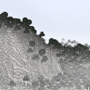

# Noisium Chunk Manager

A rewrite of Minecraft's server world chunk manager.  
This mod is an addon for [Noisium](https://github.com/Steveplays28/noisium).

Noisium Chunk Manager does NOT have 1:1 parity with vanilla worldgen (worldgen without Noisium Chunk Manager).  
Keep in mind that this is separate from [Noisium](https://github.com/Steveplays28/noisium), as this is an addon.

Noisium Chunk Manager replaces Minecraft's `ServerChunkManager` with a rewritten server world chunk manager. Any method calls to this class
are redirected to the rewritten server world chunk manager via Mixins.  
Noisium Chunk Manager also completely removes `ThreadedAnvilChunkStorage` and `ChunkHolder`.  
Any mods that interact with`ThreadedAnvilChunkStorage` will crash the game and any mods that interact with `ChunkHolder` will not function
as intended, but may not crash the game.  
See the [incompatibilities](#incompatibilities) below.

## Dependencies

### Required

None.

## Compatibility info

### Compatible mods

Noisium Chunk Manager should be compatible with most of the popular world generation mods, as long as they do not interact with
`ThreadedAnvilChunkStorage`, see the [description](#noisium-chunk-manager) above.

- [Distant Horizons](https://modrinth.com/mod/distanthorizons)
    - A compatibility mixin is included in Noisium Chunk Manager
- [ModernFix](https://modrinth.com/mod/modernfix)
    - `mixin.perf.remove_spawn_chunks=false` must be added to `config/modernfix-mixins.properties`

### Incompatibilities

See
the [issue tracker](https://github.com/steves-underwater-paradise/noisiumchunkmanager/issues?q=is%3Aissue+is%3Aopen+sort%3Aupdated-desc+label%3Acompatibility)
for a list of incompatibilities.

- C2ME: Noisium Chunk Manager replaces C2ME

## Download

See the version info in the filename for the supported Minecraft versions.  
Made for the Fabric, Quilt, Forge, and NeoForge modloaders.  
Client-side and server-side.

## FAQ

- Q: Will you be backporting this mod to lower Minecraft versions?  
  A: No.

- Q: Does this mod work in multiplayer?  
  A: Yes.

- Q: Does only the server need this mod or does the client need it too?  
  A: Both the client and the server need this mod.

## License

This project is licensed under LGPLv3,
see [LICENSE](https://github.com/steves-underwater-paradise/noisiumchunkmanager/1.20-1.20.1/main/LICENSE).
